# 엣지 컴퓨팅 영상 인식 기반의 지능형 보행 감지 시스템 

## tracking
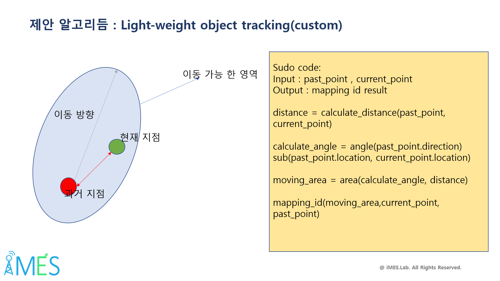
저희 custom tracking 알고리즘은 xavior에서 낮은 delay를 달성 하기 위해 iou 기반이 아닌 거리 기반의 mapping 방식을 체택 하였습니다.
그 이유는 sort 알고리즘에서 iou 즉 과거 frame 과 현 frame 에서 감지된 물체의를 감싸는 bounding box의 겹치는 정도를 기준 으로 mappin을 진행 하게 되며
이 iou 값의 정확도를 높이기 위해 칼만 필터를 이용하여 detecting 된 물체의 bounding box 크기를 조정 하여 사람이 들어 있지 않은 불필요한 부분은 제거 하는 것이기 때문에 overhead가 높은 칼만 필터를 제거 하면서 정확도 손실을 줄이기 위해 현재 탐색된 object 들의 아이디가 과거 주변에 가장 가까이 위치했던 object에 mapping 되도록 tracking
알고리즘을 디자인 하였습니다 또한 mapping을 위한 후보 군들의 숫자를 줄이기 위해 물체의 이동 방향과 속도를 고려 하여 한프레임 내에 이동 가능한 영역을 설정 한 후
이동 가능 영역에 존재하는 object 만인 mapping 후보군이 되게 하였으며 이동 방향을 고려 하여 주 이동 방향에 더 넓은 이동 가능 영역을 할당하고 나머지 부분의 이동영역을 좁혀
다른 object의 간섭을 최소화 하였습니다 이와 같은 경량화를 통해 칼만 필터의 보정 overhead를 감소 시키  면서 정확도 손실을 최소화 하였으며 0.1~0.5 정도의 delay를 달성하여 sort 대비 2배 정도의 tracking 속도를 달성 하였습니다 

### MOTA
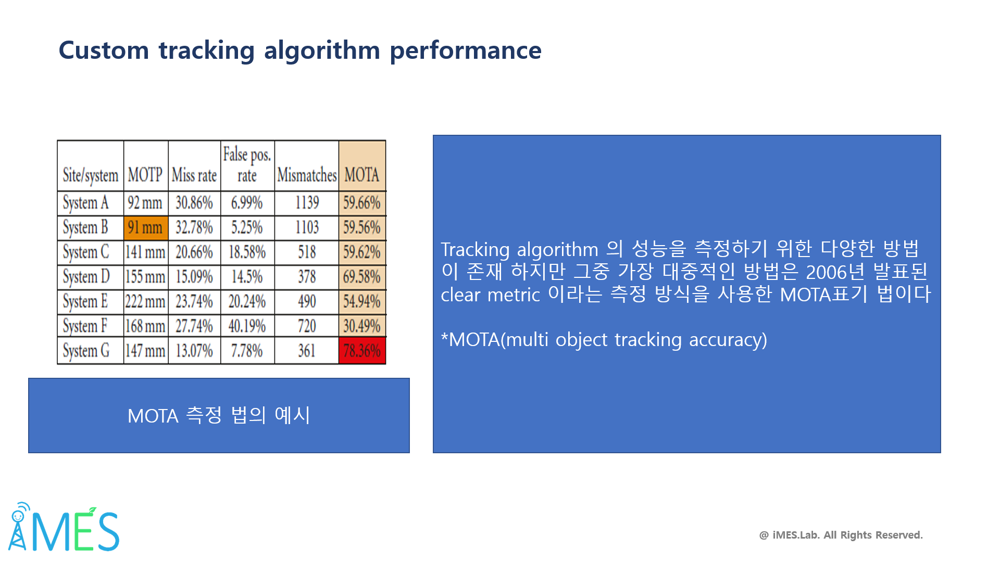
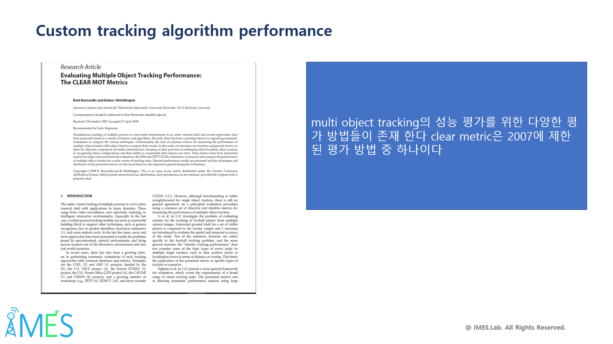
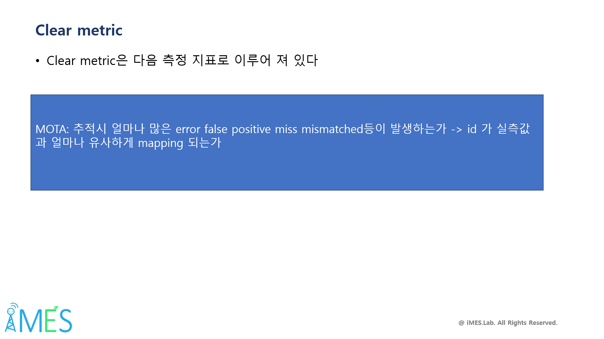
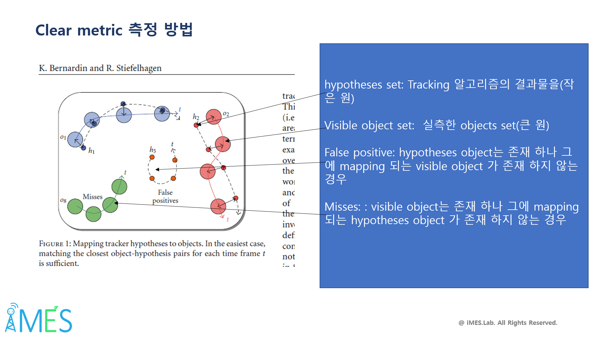
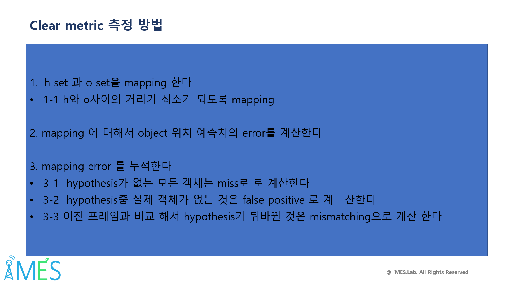
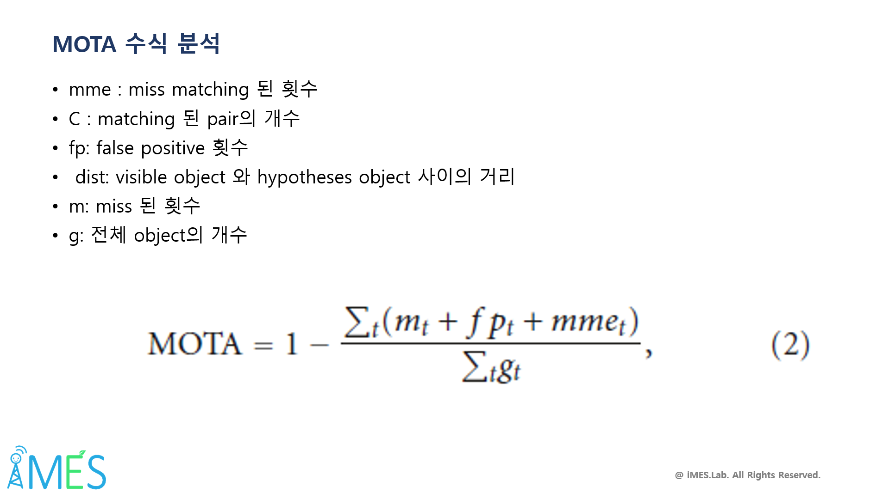
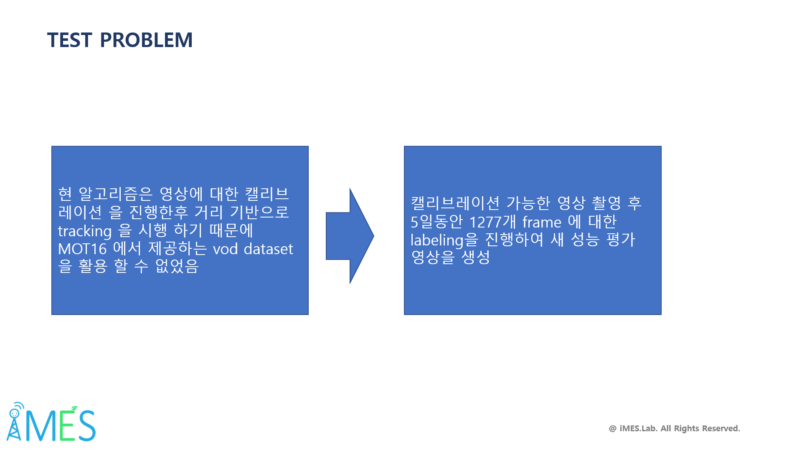
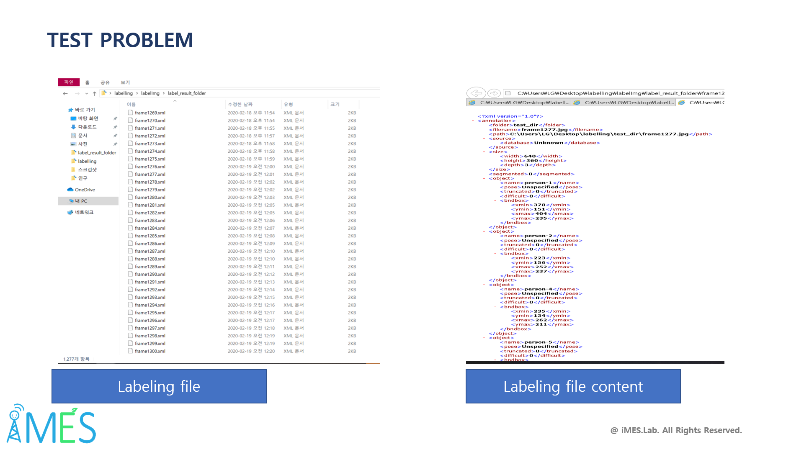
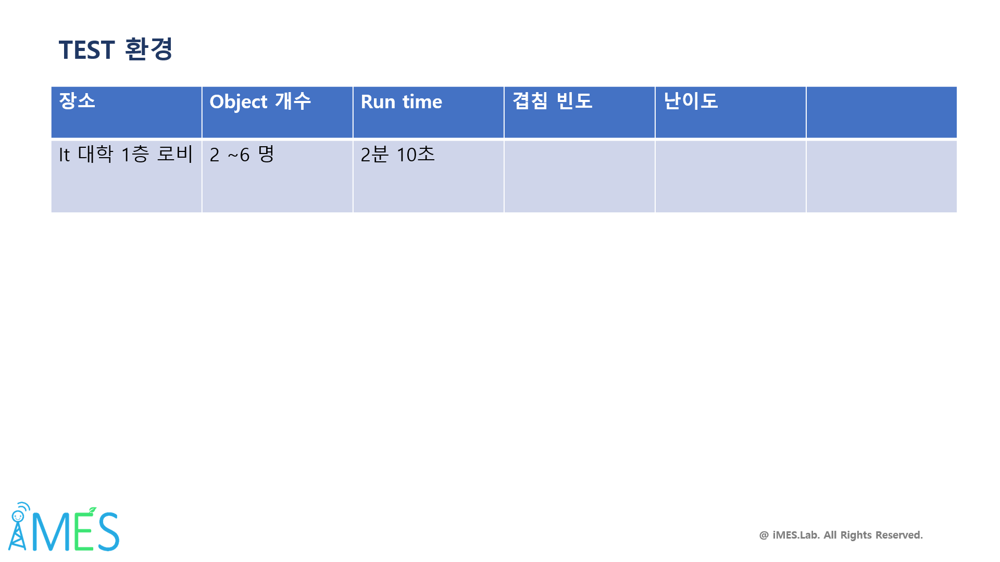
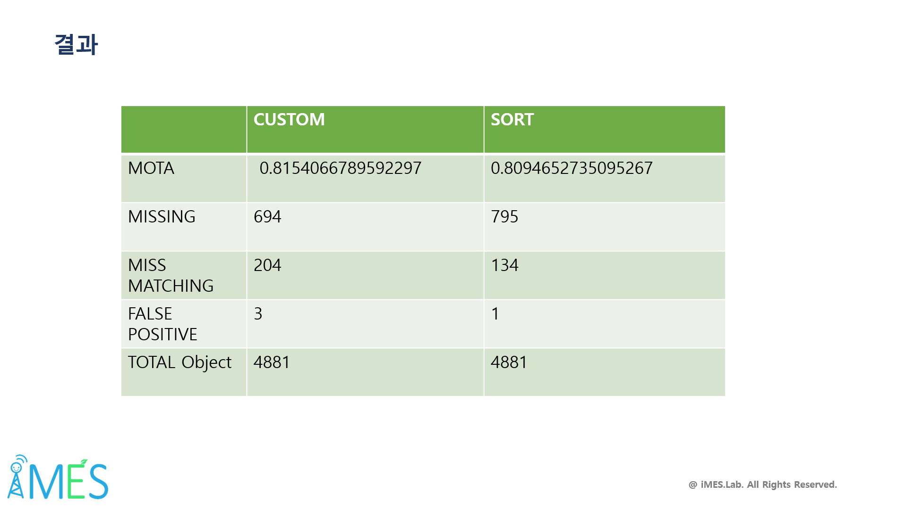
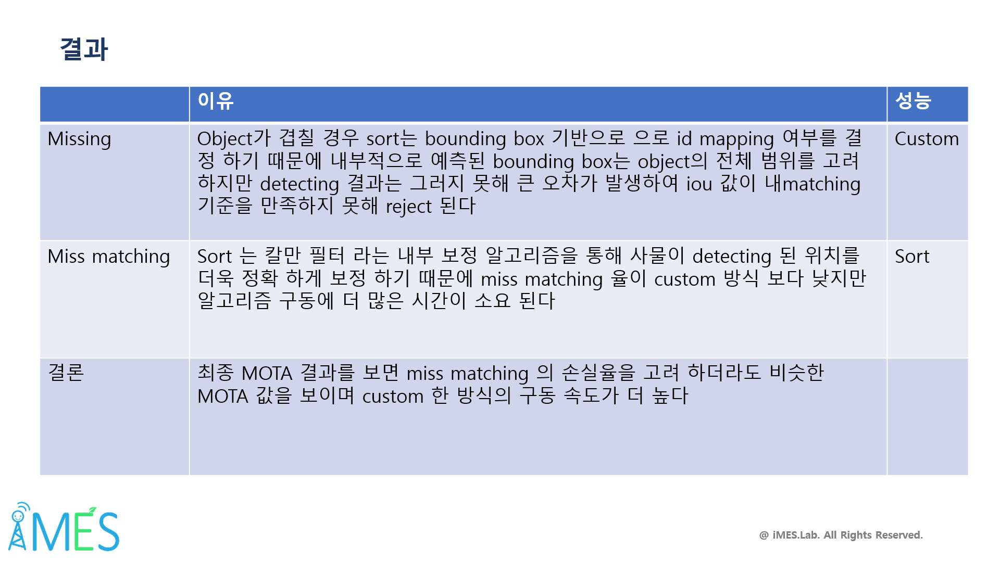

## calibrate

